<p align="center">
  <a href="https://vibld.com">
    <picture>
      <source media="(prefers-color-scheme: dark)" srcset="docs/images/banner-dark.png">
      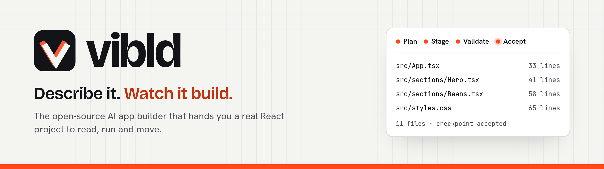
    </picture>
  </a>
</p>

<p align="center">
  <a href="https://github.com/vibld/vibld/actions/workflows/ci.yml"></a>
  <a href="https://github.com/vibld/vibld/actions/workflows/codeql.yml"></a>
  <a href="https://github.com/vibld/vibld/releases"></a>
  <a href="LICENSE"></a>
  
  <a href="https://github.com/vibld/vibld/discussions"></a>
</p>

<p align="center">
  <a href="https://vibld.com"><b>Website</b></a> ·
  <a href="https://vibld.com/docs">Docs</a> ·
  <a href="https://vibld.com/examples">Examples</a> ·
  <a href="https://vibld.com/styles">Styles</a> ·
  <a href="https://vibld.com/roadmap">Roadmap</a> ·
  <a href="https://github.com/vibld/vibld/discussions">Discussions</a> ·
  <a href="https://app.vibld.com">Sign in</a>
</p>

---

<h3 align="center">Describe a website or an app. Watch it being built. Keep the code.</h3>

<p align="center">
  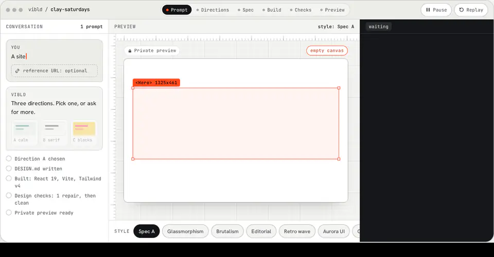
  <br>
  <sub>The builder on <a href="https://vibld.com">vibld.com</a>'s home page, recorded from the site's own production build.</sub>
</p>

**vibld** turns plain words into a conventional React and TypeScript project. It picks a direction with you, writes the design down, builds in bounded steps, checks its own work against what it wrote, proves the result compiles, and hands you code you can read line by line, run anywhere and take with you.

<table>
  <tr>
    <td width="33%" valign="top">
      <h4>🧾 You own the code</h4>
      A plain Vite project: React 19, TypeScript, Tailwind v4. No vibld runtime, no proprietary format, no lock-in. Download it, push it to your GitHub or publish it, and it keeps working without us.
    </td>
    <td width="33%" valign="top">
      <h4>🔍 It shows its work</h4>
      A plan, a <code>DESIGN.md</code>, every file as it lands, a check report, a verification build and a per-run record of model, tokens and cost. Nothing happens off screen.
    </td>
    <td width="33%" valign="top">
      <h4>🔓 It is open source</h4>
      The builder, the sandbox and the publish service here are the ones running at <a href="https://app.vibld.com">app.vibld.com</a>, under Apache-2.0. Bring one API key and build from your own terminal.
    </td>
  </tr>
</table>

> [!NOTE]
> vibld is **early**. The hosted service is a public beta that anyone can [sign up](https://app.vibld.com/sign-up) for, and the [status](#status) section says plainly what works and what does not yet.

## Contents

- [Three ways to use it](#three-ways-to-use-it)
- [How it works](#how-it-works)
- [What it has built](#what-it-has-built)
- [Designed, not templated](#designed-not-templated)
- [Features](#features)
- [Status](#status)
- [Quick start](#quick-start)
- [Architecture](#architecture)
- [Running it yourself](#running-it-yourself)
- [Documentation](#documentation)
- [Contributing](#contributing)
- [Licence](#licence)

## Three ways to use it

|                    | ☁️ **Hosted**                                                                          | ⌨️ **Your key, your terminal**                                                         | 🛠️ **Self-hosted**                                                                                         |
| ------------------ | -------------------------------------------------------------------------------------- | -------------------------------------------------------------------------------------- | ---------------------------------------------------------------------------------------------------------- |
| **What you get**   | The whole builder: chat, previews, projects, sharing, GitHub and publishing.           | The same bounded build, from the command line, writing a project to disk.              | Your own copy of the hosted service on your Cloudflare account.                                            |
| **What you need**  | A browser. [Sign up](https://app.vibld.com/sign-up).                                   | Node 24, pnpm and one Anthropic, OpenAI or DeepSeek key.                               | Cloudflare (Workers Paid for previews), Clerk, a model key; Stripe and a GitHub App only if you want them. |
| **What it costs**  | Free plan, or a paid plan with more model spend. [Pricing](https://vibld.com/pricing). | What your provider bills. The weekly proof run costs about $0.15 to $0.31 on DeepSeek. | Your Cloudflare and provider bills.                                                                        |
| **Where to start** | [Getting started](https://vibld.com/docs/getting-started)                              | [Quick start](#generate-a-real-project-with-your-own-key)                              | [Self-hosting](https://vibld.com/docs/self-hosting) (documented, not yet validated outside the project)    |

<p align="center">
  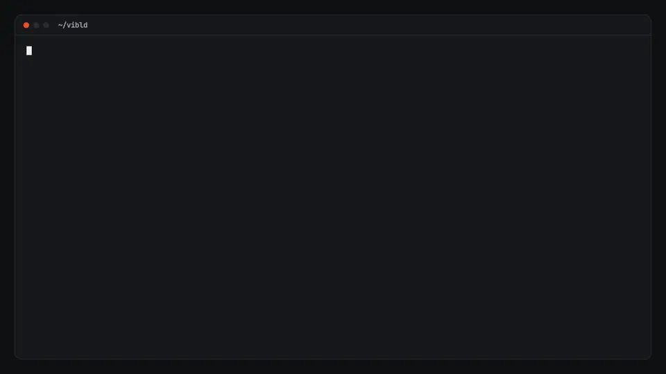
  <br>
  <sub><code>pnpm generate --build</code> from a clean clone with one DeepSeek key, replayed from the weekly proof run's own log (13 minutes, shown faster).</sub>
</p>

## How it works

| Step                              | What happens                                                                                                                                                                                                                          |
| --------------------------------- | ------------------------------------------------------------------------------------------------------------------------------------------------------------------------------------------------------------------------------------- |
| **1. Say what you want**          | Plain words. It may answer, or ask one or two questions first; when you say go, your answers become a full brief. Style, a reference page, your own images and video, and standing instructions sit in one row under the message box. |
| **2. Pick a direction**           | Choose one of 24 [style presets](https://vibld.com/styles), with suggestions for the mood your request names, or ask for three directions to compare before anything is built.                                                        |
| **3. It writes the spec down**    | The direction becomes `DESIGN.md`: colours, type, breakpoints and motion the build has to honour, kept in the project.                                                                                                                |
| **4. It builds in bounded steps** | A plan, then files in small groups, each with a ceiling on tokens and time. A draft of the page shows while the first build runs, and a build keeps going if you close the tab.                                                       |
| **5. It checks its own work**     | Design checks read the files against the spec (colours, type, breakpoints, alt text, contrast, motion, copy). Then a real production build: if it fails, one repair patch, then the build again.                                      |
| **6. Look at it live**            | Run a live preview: the real dev server in a private sandbox, which picks up each new revision in place. Share it by link until you revoke it.                                                                                        |
| **7. Ship it, or take the code**  | Download a `.zip`, create or push to a GitHub repository for this project, or publish it at `<name>.vibld-preview.dev`. Unpublishing is one step too.                                                                                 |

<details>
<summary><b>The builder, screen by screen</b></summary>
<br>

<picture>
  <source media="(prefers-color-scheme: dark)" srcset="docs/images/builder-prompt-dark.webp">
  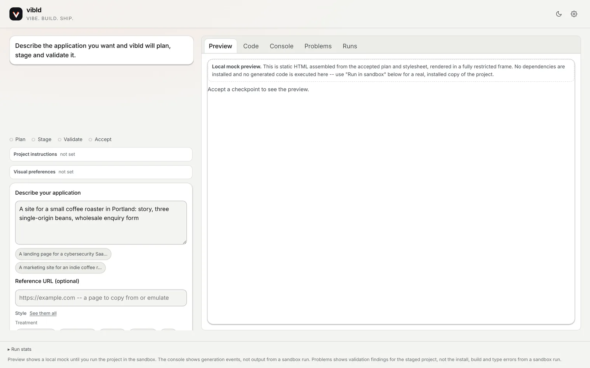
</picture>
<p align="center"><sub><b>Describe it.</b> The message box, with Style, Reference, Media and Preferences beside it.</sub></p>

<picture>
  <source media="(prefers-color-scheme: dark)" srcset="docs/images/builder-generating-dark.webp">
  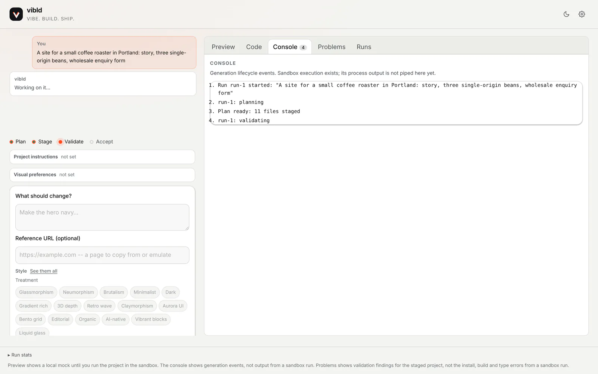
</picture>
<p align="center"><sub><b>Watch it build.</b> Each step as it happens, with every event in the console.</sub></p>

<picture>
  <source media="(prefers-color-scheme: dark)" srcset="docs/images/builder-code-dark.webp">
  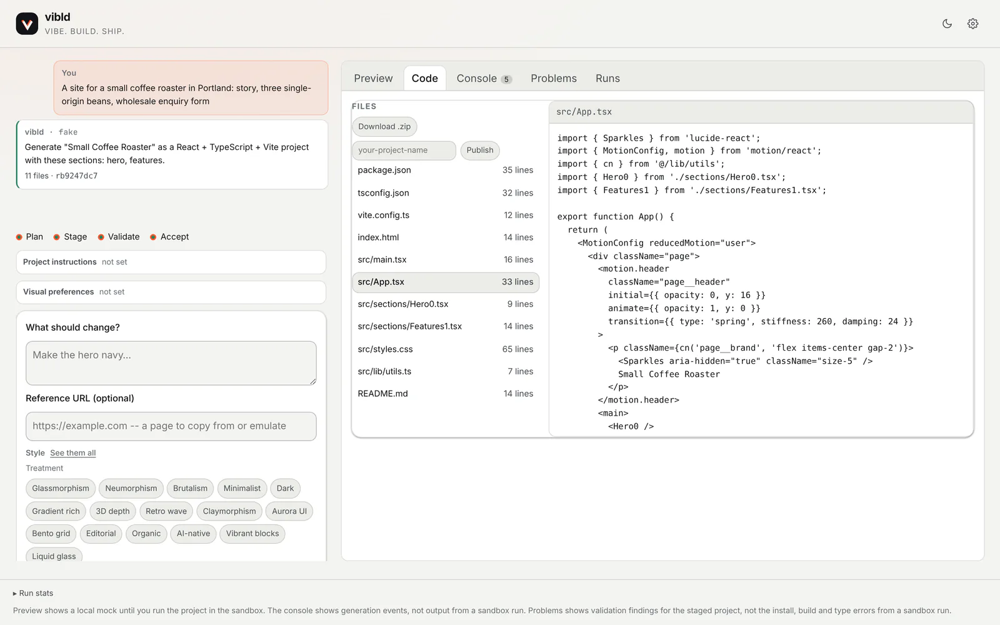
</picture>
<p align="center"><sub><b>Read it.</b> Every file, as written.</sub></p>

<sub>These screenshots are from a local checkout, which uses a deterministic fake provider instead of a model (tagged <code>vibld · fake</code>), so the files shown are fixture output.</sub>

</details>

## What it has built

Real builds from the evaluation suite, published exactly as the model wrote them, with no hand edits. Each links to its live copy; the prompt, the run and anything worth knowing are on [vibld.com/examples](https://vibld.com/examples), and the source is in [`examples/generated`](examples/generated).

<table>
  <tr>
    <td width="50%" valign="top">
      <a href="https://example-coffee-roaster-opus-5-5.vibld-preview.dev/">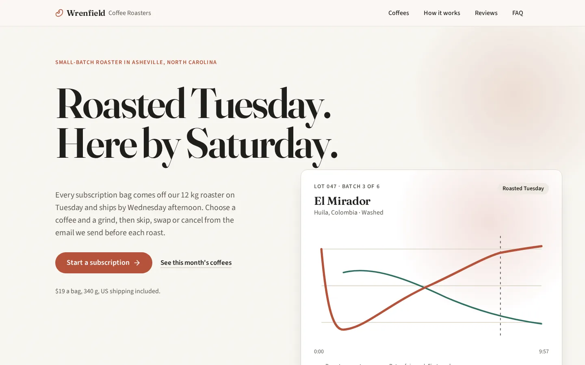</a>
      <br><b>An indie coffee roaster</b> <sub>· site · Claude Opus 5.5</sub>
    </td>
    <td width="50%" valign="top">
      <a href="https://example-security-saas-opus-5-5.vibld-preview.dev/">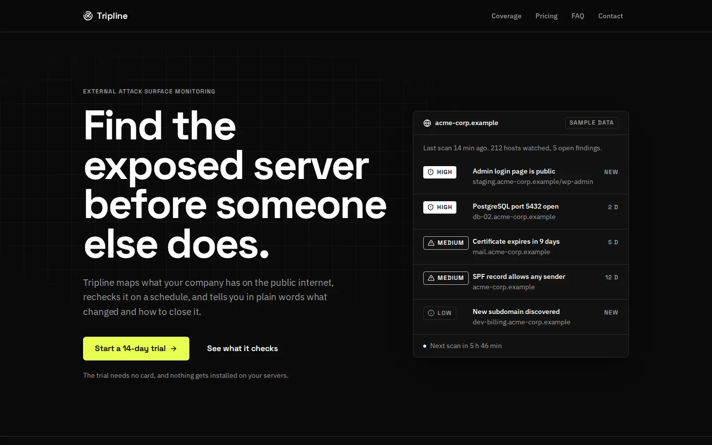</a>
      <br><b>A cybersecurity SaaS</b> <sub>· site · Claude Opus 5.5</sub>
    </td>
  </tr>
  <tr>
    <td width="50%" valign="top">
      <a href="https://example-conference-gpt-6-sol.vibld-preview.dev/">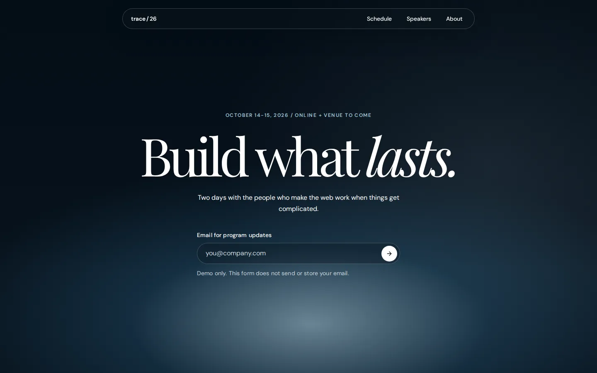</a>
      <br><b>A developer conference</b> <sub>· site · GPT-6 Sol</sub>
    </td>
    <td width="50%" valign="top">
      <a href="https://example-budget-tracker-gpt-6-sol.vibld-preview.dev/">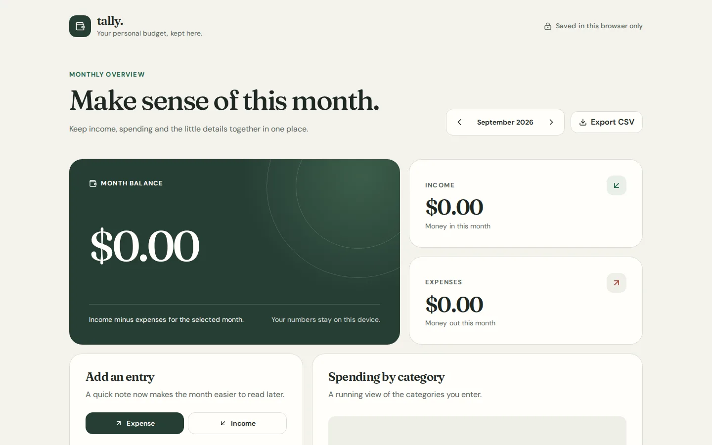</a>
      <br><b>A personal budget tracker</b> <sub>· app · GPT-6 Sol</sub>
    </td>
  </tr>
  <tr>
    <td width="50%" valign="top">
      <a href="https://example-dental-practice-opus-5-5.vibld-preview.dev/">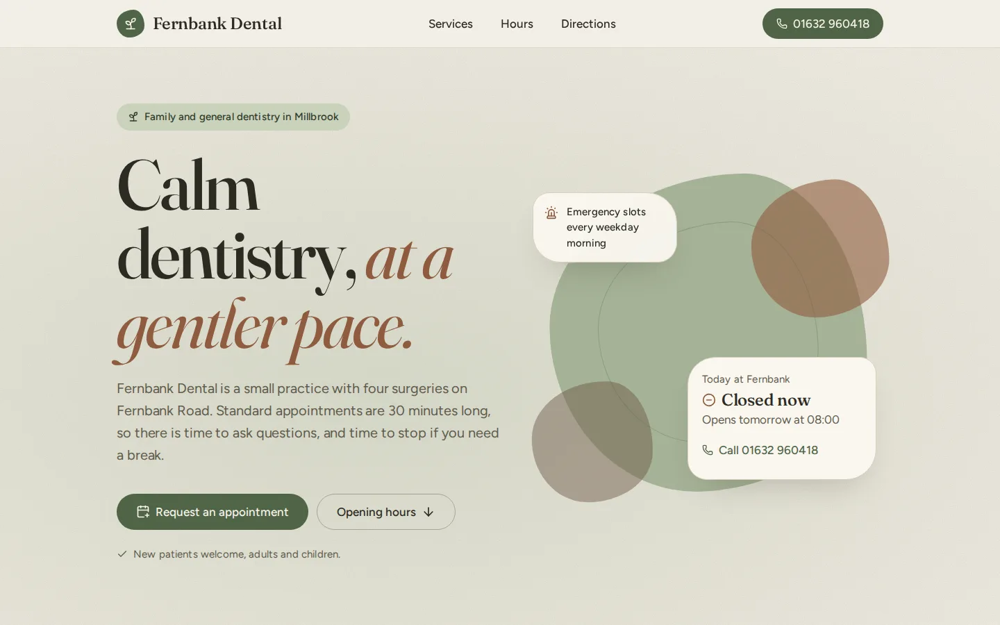</a>
      <br><b>A dental practice</b> <sub>· site · Claude Opus 5.5</sub>
    </td>
    <td width="50%" valign="top">
      <a href="https://example-freelance-portfolio-opus-5-5.vibld-preview.dev/">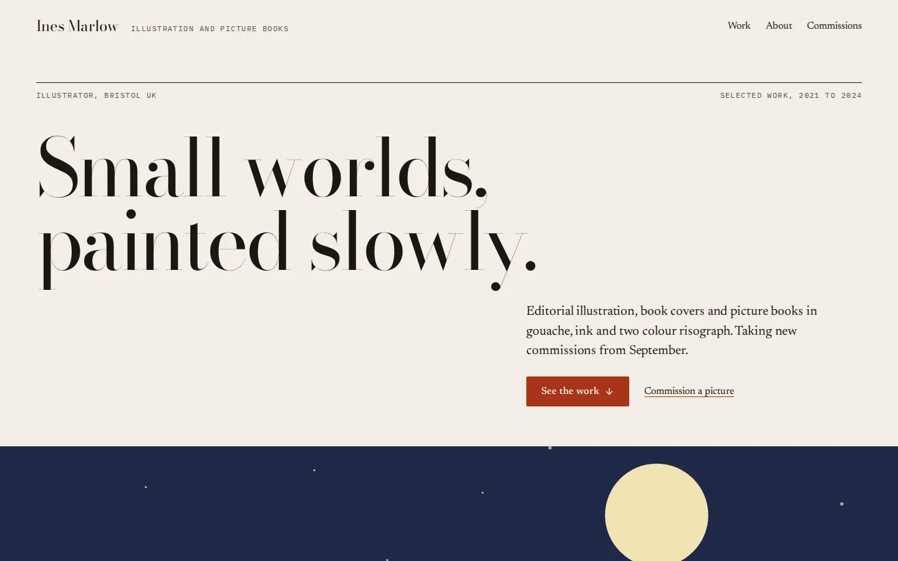</a>
      <br><b>An illustrator's portfolio</b> <sub>· site · Claude Opus 5.5</sub>
    </td>
  </tr>
</table>

Two hand-built starter templates ship alongside, each under its own MIT licence: [`templates/marketing`](templates/marketing), a plain prerendered marketing site, and [`templates/luminous`](templates/luminous), a product site with a cursor-reactive glow, dressed for an invented SaaS called Emberline.

## Designed, not templated

Every build starts from a written design, not a theme. There are 24 style presets, 16 surface treatments from Editorial and Brutalism to Liquid glass, and 8 complete colour systems. Each carries mood tags (luxe, calm, technical, organic, playful, brutal), so the picker can suggest the ones your request describes.

<p align="center">
  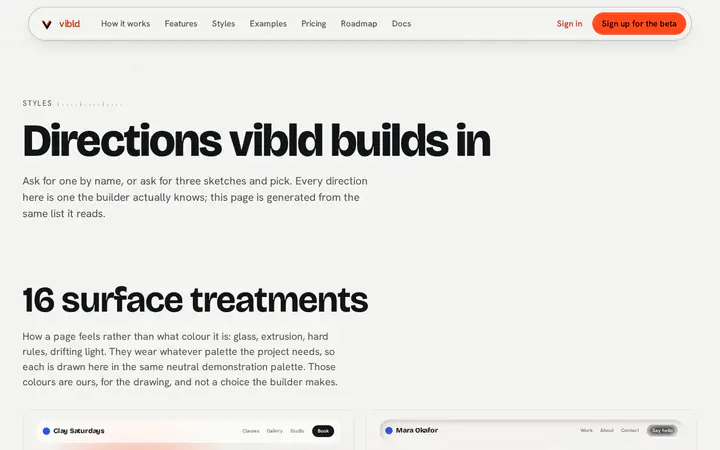
  <br>
  <sub>The style presets on <a href="https://vibld.com/styles">vibld.com/styles</a>.</sub>
</p>

Ask for an aurora, a starfield, a smoky gradient or any "animated background", and the build imports one of four backgrounds written once and tested, rather than improvising a canvas loop. Each takes the project's own colour tokens, caps its pixel ratio, pauses off screen and holds still for anyone who asks for reduced motion.

<p align="center">
  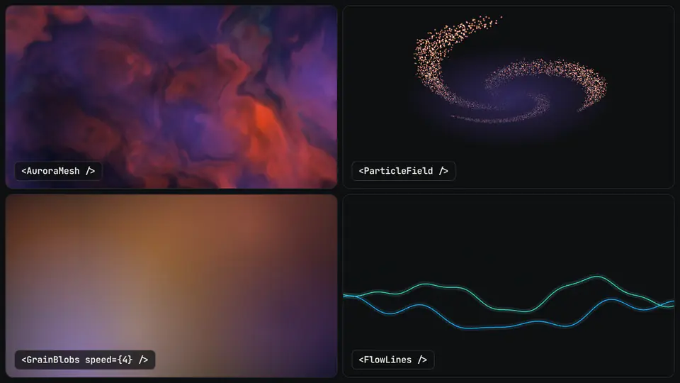
  <br>
  <sub>The four backgrounds in <a href="packages/ai/src/backdrops.ts"><code>packages/ai/src/backdrops.ts</code></a>, bundled from the exact source a project is given and run in Chromium.</sub>
</p>

## Features

**Building**

- A conversation, not a form: the agent answers questions, asks its own when a request is thin, and builds when you say so. Follow-ups ("make the hero navy") change the project rather than starting over.
- Model providers behind one contract in [`packages/ai`](packages/ai): Anthropic, OpenAI and DeepSeek adapters, chosen per run.
- Bounded, multi-step builds: a plan, then files in groups, each with its own ceiling on tokens and time, that keep running when you close the tab.
- Three directions to compare before the first build, 24 style presets with mood suggestions, a reference page whose text, colours, fonts and spacing the spec measures, and your own uploaded images and video.
- Four tested animated backgrounds a build imports when a request asks for motion.

**Checking**

- Design checks against the project's own `DESIGN.md`: palette, type, breakpoints, alt text, labels, contrast, reduced motion, media, copy and canvas performance.
- A verification build of every result, with one repair patch when it fails, and a badge that says which: checking, fixing, does not build or not checked.
- A spend ceiling reserved before each run starts, not counted after it finishes.

**Previewing, sharing and shipping**

- A live preview in a private sandboxed container running the real dev server, updated in place as the project changes, with revocable share links ([`apps/preview`](apps/preview)).
- Projects: save, rename, archive, duplicate and delete, a read-only share link, and Remix for anyone you send it to.
- One Ship menu: download a `.zip`, create or push to a GitHub repository for each project, or publish to `<name>.vibld-preview.dev` with safe default security headers ([`apps/publish`](apps/publish)).
- A Runs tab: every run's model, tokens, cost and why it stopped.

**Accounts and operations**

- Sign-in with Clerk; projects in Cloudflare D1, R2 and a per-user Durable Object; builds as Cloudflare Workflows.
- Plans and model-spend credit with Stripe, referrals, an access gate that is invite-only unless a deployment opens it, an admin panel with credit grants, bans and an audit log, and operator takedown for abuse reports.
- An evaluation suite ([`packages/eval`](packages/eval)) and a model bakeoff, so model choices are measured, not guessed.

## Status

**What runs today.** Everything above, deployed at [app.vibld.com](https://app.vibld.com) as a public beta. Paid plans are live; the Free plan builds with GPT-6 Luna, and a new account gets $1.00 of build credit once it adds a card, which is saved and not charged. From a checkout, `pnpm generate --build` builds a real project with your own provider key, and [a weekly workflow](.github/workflows/clean-clone.yml) proves that from a clean clone.

**What does not exist yet.**

- Repository search over an existing codebase (internal issue 12).
- A bakeoff result strong enough to recommend one model over another. The harness exists and has run; the evidence does not settle it yet.
- Sandbox output in the builder's own panes. The console shows generation events, and Problems shows the design checks and the verification build, not the install, build and type errors from a live preview.
- A validated self-hosting path. The pieces are documented (see below), but nobody outside the project has deployed their own copy yet.
- The builder's interface against a real model on your own machine. Locally it runs the fake provider; its model path needs sign-in, D1, R2 and a Workflow, which only a Cloudflare deployment has. `pnpm generate` is the local way to a real build today.

**What to be careful of.** It is a beta, not a place for work you cannot afford to lose. Very little of it has been used by anyone other than its author, which is a different kind of risk from a missing feature and not one a feature list shows.

The [accepted decisions](docs/decisions.md), the [architecture decision records](docs/adr/README.md) and the [roadmap](ROADMAP.md) say where it is going and why.

## Quick start

You need Node.js 24 (the LTS release CI uses; 22.15 or newer also works) and pnpm. The version is pinned in `package.json`, and `corepack enable` provides it.

```bash
git clone https://github.com/vibld/vibld.git
cd vibld
pnpm install --frozen-lockfile
```

### Generate a real project with your own key

One provider key is all this needs: no account, database or Cloudflare. It runs the same bounded build as [app.vibld.com](https://app.vibld.com), prints each step and what it cost in tokens, and writes the project it built.

```bash
export DEEPSEEK_API_KEY=...   # or ANTHROPIC_API_KEY, or OPENAI_API_KEY

pnpm generate "A one-page site for a neighbourhood bakery, with opening hours and a menu" --out ./my-site --build

cd my-site
npm run dev                   # the generated project, with no vibld dependency
```

| Option             | What it does                                                                                                                                                                            |
| ------------------ | --------------------------------------------------------------------------------------------------------------------------------------------------------------------------------------- |
| `--out <dir>`      | Where the project is written, relative to where you ran the command.                                                                                                                    |
| `--build`          | Installs and builds the result with npm and, when it does not build, asks for one repair with the compiler's output. The build gets no credential from your environment.                |
| `--style <id>`     | One of the style presets, by id: `editorial`, `brutalism`, `liquidGlass`, `bentoGrid`, `warmPaper`, `cinematic` and the rest in [`style-presets.ts`](packages/ai/src/style-presets.ts). |
| `--base <dir>`     | Makes the prompt a follow-up to a project already on disk.                                                                                                                              |
| `VIBLD_MODEL=<id>` | Another model from [the catalogue](packages/ai/src/model-catalogue.ts). With one key set, that provider's default answers: `deepseek-flash`, `gpt-5.6-terra` or `claude-opus-5-5`.      |

The calls are billed to your key. The weekly proof run, a one-page bakery site on DeepSeek's default model, has taken 7 to 17 minutes and cost $0.15 to $0.31, most of it the model's reasoning. A larger request or a costlier model costs more: Claude Opus 5.5, Anthropic's default here, costs many times what DeepSeek Flash does. [`packages/ai/README.md`](packages/ai/README.md) has the details.

### Run the builder locally

```bash
pnpm --filter @vibld/web dev   # the builder, at http://localhost:5173
```

Locally, the builder runs with no sign-in and a deterministic fake provider, so you can go through the whole flow at no cost and no model is called. [`apps/web/README.md`](apps/web/README.md) covers deploying it with a real model provider, sign-in, the sandbox and the rest.

### Before you open a pull request

```bash
pnpm format:check   # Prettier
pnpm check:style    # house style, including no em-dashes
pnpm typecheck      # every workspace, through Turborepo
pnpm test
pnpm test:scripts   # the repository scripts
pnpm build          # every app's production build
```

## Architecture

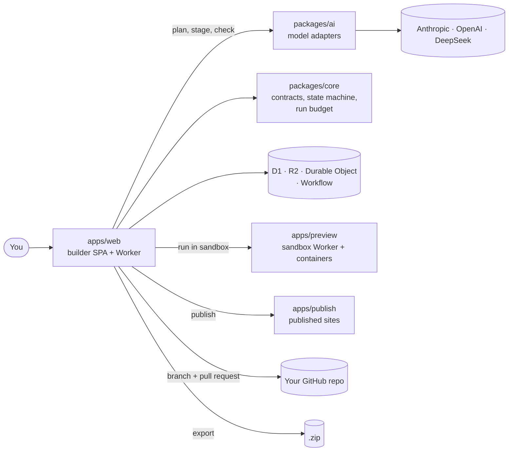

| Path                                                     | What it is                                                                                         |
| -------------------------------------------------------- | -------------------------------------------------------------------------------------------------- |
| [`apps/web`](apps/web)                                   | The builder: a React single-page app and the Cloudflare Worker behind it.                          |
| [`apps/preview`](apps/preview)                           | The sandbox Worker that installs and runs a generated project in a container for private previews. |
| [`apps/publish`](apps/publish)                           | Serves published sites on `*.vibld-preview.dev`.                                                   |
| [`apps/marketing`](apps/marketing)                       | [vibld.com](https://vibld.com), built with the same stack generated sites use.                     |
| [`packages/core`](packages/core)                         | Generation contracts, the state machine and the run budget. No provider code.                      |
| [`packages/ai`](packages/ai)                             | Model adapters, prompts, style presets and the design checks.                                      |
| [`packages/eval`](packages/eval)                         | The evaluation cases and the checks that decide whether a generated project is accepted.           |
| [`packages/brand`](packages/brand)                       | The palette and mark, shared by every surface.                                                     |
| [`packages/security-headers`](packages/security-headers) | Response headers for vibld.com and app.vibld.com.                                                  |
| [`templates`](templates)                                 | Starter templates, each MIT licensed.                                                              |
| [`examples`](examples)                                   | Real generated projects, kept exactly as generated.                                                |
| [`docs`](docs)                                           | Decisions, ADRs, the implementation plan and the brand guide.                                      |

[VIBLD.md](VIBLD.md) is the product and architecture charter behind all of it.

## Running it yourself

Self-hosting is possible, and still needs validation: nobody outside the project has deployed their own copy yet. A deployment needs:

- **Cloudflare**, for three Workers (the builder, the sandbox and the publish service) plus D1, R2, a Durable Object and a Workflow behind the builder. Live previews and publishing run generated code in [Containers](https://developers.cloudflare.com/containers/), which need the Workers Paid plan, and building the sandbox image needs Docker.
- **A model provider API key.** Without one, generation refuses rather than degrading. The builder's configuration ships `VIBLD_MODEL` as `gpt-6-sol`: set it to a model your key serves, or a copy with only another provider's key falls back to whichever of that provider's models the catalogue lists first.
- **Clerk**, for sign-in. There is no hosted mode without authentication, because the endpoints spend money.
- **An open door.** A deployment is invite-only until `VIBLD_ACCESS_MODE` is `open`: before that, only the verified emails in `VIBLD_PLATFORM_ADMINS` and the people they invite get in, so list your own. Clerk's session token has to carry `email` and `email_verified` for that match to work.
- **Your own names.** The Worker names, database, bucket, Workflow, routes and Clerk domain in the `wrangler.jsonc` files are vibld's. `node scripts/self-host.mjs <settings.json>` writes a `wrangler.self-host.jsonc` beside each with all of them derived from a prefix of yours, and refuses to write one that still names vibld's ([Deploying](https://vibld.com/docs/deploying)).
- **Stripe** only if you intend to charge anybody, **a GitHub App** only if you want push-to-repository, and **Resend** only for email. Each optional piece left unset reports itself unavailable rather than running without its check.

Read next: [what self-hosting involves](https://vibld.com/docs/self-hosting), [every setting and secret](https://vibld.com/docs/configuration), [deploying your own copy](https://vibld.com/docs/deploying) and [hosted or self-hosted](https://vibld.com/docs/hosted-vs-self-hosted). The exact commands are in [`apps/web/README.md`](apps/web/README.md), [`apps/preview/README.md`](apps/preview/README.md) and [`apps/publish/README.md`](apps/publish/README.md), beside the code they deploy. The workflows that deploy vibld's own hosted service run only in the maintainers' working repository, since a copy has none of their secrets.

## Documentation

| If you want to                             | Read                                                                                                                                                                                                                                                                                                              |
| ------------------------------------------ | ----------------------------------------------------------------------------------------------------------------------------------------------------------------------------------------------------------------------------------------------------------------------------------------------------------------- |
| Use the hosted builder                     | [Getting started](https://vibld.com/docs/getting-started) · [The builder](https://vibld.com/docs/the-builder) · [Running your project](https://vibld.com/docs/running-your-project) · [Taking your code](https://vibld.com/docs/taking-your-code) · [Credits and plans](https://vibld.com/docs/credits-and-plans) |
| Build from your terminal with your own key | [Quick start](#generate-a-real-project-with-your-own-key) · [`packages/ai/README.md`](packages/ai/README.md)                                                                                                                                                                                                      |
| Run your own copy                          | [Self-hosting](https://vibld.com/docs/self-hosting) · [Configuration](https://vibld.com/docs/configuration) · [Deploying](https://vibld.com/docs/deploying) · [`apps/web/README.md`](apps/web/README.md)                                                                                                          |
| Understand why it is built this way        | [VIBLD.md](VIBLD.md) · [Decisions](docs/decisions.md) · [ADRs](docs/adr/README.md) · [Roadmap](ROADMAP.md)                                                                                                                                                                                                        |
| Change it                                  | [CONTRIBUTING.md](CONTRIBUTING.md) · [Architecture](#architecture) · [the brand guide](docs/brand.md)                                                                                                                                                                                                             |

## Contributing

Issues, discussions and pull requests are welcome. Start with [CONTRIBUTING.md](CONTRIBUTING.md), which also explains how a change reaches this repository, and the [code of conduct](CODE_OF_CONDUCT.md). Questions and ideas go to [Discussions](https://github.com/vibld/vibld/discussions); bugs go to [issues](https://github.com/vibld/vibld/issues/new/choose).

Found a vulnerability? Report it privately through [SECURITY.md](SECURITY.md), never in a public issue.

## Licence

Built by [Chris Brock (@cbrock84)](https://github.com/cbrock84), the lead maintainer ([GOVERNANCE.md](GOVERNANCE.md)); [CITATION.cff](CITATION.cff) says how to cite it.

The core is licensed under [Apache-2.0](LICENSE); see also [NOTICE](NOTICE). The starter templates in `templates/marketing` and `templates/luminous` each carry their own MIT `LICENSE` at their own boundary, which does not relicense the core ([ADR-0008](docs/adr/0008-portable-marketing-site-template.md)). [THIRD_PARTY_NOTICES.md](THIRD_PARTY_NOTICES.md) lists the projects whose material is adapted here, with the licence text each one publishes.
