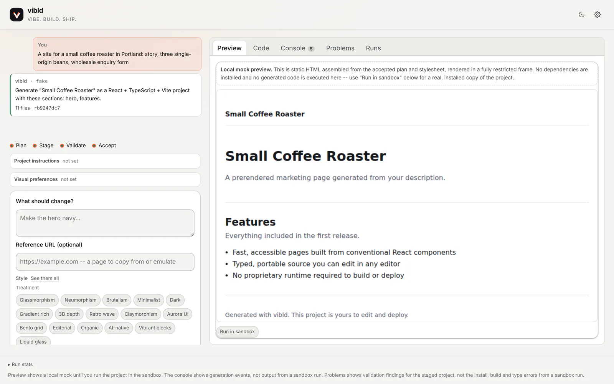

<p align="center">
  <a href="https://vibld.com">
    <picture>
      <source media="(prefers-color-scheme: dark)" srcset="docs/images/banner-dark.png">
      
    </picture>
  </a>
</p>

<p align="center">
  <a href="https://github.com/vibld/vibld/actions/workflows/ci.yml"></a>
  <a href="https://github.com/vibld/vibld/actions/workflows/codeql.yml"></a>
  <a href="https://github.com/vibld/vibld/releases"></a>
  <a href="LICENSE"></a>
  
  <a href="https://github.com/vibld/vibld/discussions"></a>
</p>

<p align="center">
  <a href="https://vibld.com"><b>Website</b></a> ·
  <a href="https://vibld.com/docs">Docs</a> ·
  <a href="https://vibld.com/examples">Examples</a> ·
  <a href="https://vibld.com/styles">Styles</a> ·
  <a href="https://github.com/vibld/vibld/discussions">Discussions</a> ·
  <a href="https://app.vibld.com">Sign in</a>
</p>

---

**vibld** turns a description of a website or an app into a conventional React and TypeScript project. It plans the build, writes a design spec, stages the files, checks its own work against that spec, and hands you code you can read line by line, run anywhere and take with you.

- **You own the code.** The output is a plain Vite project with no vibld runtime, no proprietary format and no `.vibld/` directory. Download it, push it to your own GitHub repository or publish it, and it keeps working without us.
- **It shows its work.** Every step leaves something you can inspect: a plan, a `DESIGN.md`, staged files, a check report, a private preview.
- **Nothing is public until you say so.** Previews are private and share links are revocable. Publishing is a separate, deliberate step, and it is reversible.
- **It is open source.** The builder, the sandbox and the publish service in this repository are the ones running at [app.vibld.com](https://app.vibld.com), under Apache-2.0.

> [!NOTE]
> vibld is **early**. The hosted service is in public beta: anyone can [sign up](https://app.vibld.com/sign-up), and the [status](#status) section below spells out what works and what does not yet.

<p align="center">
  <picture>
    <source media="(prefers-color-scheme: dark)" srcset="docs/images/builder-code-dark.webp">
    
  </picture>
  <br>
  <sub>The builder, run locally. A local checkout uses a deterministic fake provider instead of a model (tagged <code>vibld · fake</code>), so the files shown are fixture output.</sub>
</p>

## Contents

- [How it works](#how-it-works)
- [What it has built](#what-it-has-built)
- [Features](#features)
- [Status](#status)
- [Quick start](#quick-start)
- [Architecture](#architecture)
- [Running it yourself](#running-it-yourself)
- [Contributing](#contributing)
- [Licence](#licence)

## How it works

| Step                                | What happens                                                                                                                                                                      |
| ----------------------------------- | --------------------------------------------------------------------------------------------------------------------------------------------------------------------------------- |
| **1. Say what you want**            | Plain words, with specifics. Project instructions hold standing rules, visual preferences hold a direction, and a reference URL points at a page to start from.                   |
| **2. Pick a direction**             | Ask for three sketches that differ in look, or name one of 24 [style presets](https://vibld.com/styles).                                                                          |
| **3. It writes the spec down**      | The direction becomes `DESIGN.md`: the colours, type, breakpoints and motion the build has to honour, written into the project.                                                   |
| **4. It stages a checkpoint**       | A plan and a set of files in React and TypeScript on Vite. Nothing acts on staged files until you accept them.                                                                    |
| **5. It checks its own design**     | The files are read against the spec: named colours, the display face, breakpoints, alt text, contrast, a reduced-motion rule. Only an error the checker is sure of buys a repair. |
| **6. Look at it privately**         | Run the project in a sandbox for a real dev server, and share a link until you revoke it.                                                                                         |
| **7. Publish it, or take the code** | Download an archive, open a pull request in a repository you connect, or publish it at a name you choose.                                                                         |

<details>
<summary><b>More of the builder</b>: the prompt, a run in progress, and the accepted result</summary>
<br>

<picture>
  <source media="(prefers-color-scheme: dark)" srcset="docs/images/builder-prompt-dark.webp">
  
</picture>
<p align="center"><sub><b>Describe it.</b> A prompt, with project instructions, visual preferences, a reference URL and the style presets beside it.</sub></p>

<picture>
  <source media="(prefers-color-scheme: dark)" srcset="docs/images/builder-generating-dark.webp">
  
</picture>
<p align="center"><sub><b>Watch it build.</b> Plan, stage, validate, accept, with every event in the console.</sub></p>

<picture>
  <source media="(prefers-color-scheme: dark)" srcset="docs/images/builder-result-dark.webp">
  
</picture>
<p align="center"><sub><b>Check it.</b> A local preview of the accepted plan, then <i>Run in sandbox</i> for a real install and dev server.</sub></p>

</details>

## What it has built

Real builds from the evaluation suite, published exactly as the model wrote them, with no hand edits. Each one links to its live copy; the prompt, the run and anything worth knowing are on [vibld.com/examples](https://vibld.com/examples), and the source is in [`examples/generated`](examples/generated).

<table>
  <tr>
    <td width="50%" valign="top">
      <a href="https://example-coffee-roaster-opus-5-5.vibld-preview.dev/"></a>
      <br><b>An indie coffee roaster</b> <sub>· site · Claude Opus 5.5</sub>
    </td>
    <td width="50%" valign="top">
      <a href="https://example-security-saas-opus-5-5.vibld-preview.dev/"></a>
      <br><b>A cybersecurity SaaS</b> <sub>· site · Claude Opus 5.5</sub>
    </td>
  </tr>
  <tr>
    <td width="50%" valign="top">
      <a href="https://example-conference-gpt-6-sol.vibld-preview.dev/"></a>
      <br><b>A developer conference</b> <sub>· site · GPT-6 Sol</sub>
    </td>
    <td width="50%" valign="top">
      <a href="https://example-budget-tracker-gpt-6-sol.vibld-preview.dev/"></a>
      <br><b>A personal budget tracker</b> <sub>· app · GPT-6 Sol</sub>
    </td>
  </tr>
  <tr>
    <td width="50%" valign="top">
      <a href="https://example-dental-practice-opus-5-5.vibld-preview.dev/"></a>
      <br><b>A dental practice</b> <sub>· site · Claude Opus 5.5</sub>
    </td>
    <td width="50%" valign="top">
      <a href="https://example-freelance-portfolio-opus-5-5.vibld-preview.dev/"></a>
      <br><b>An illustrator's portfolio</b> <sub>· site · Claude Opus 5.5</sub>
    </td>
  </tr>
</table>

Two hand-built starter templates ship alongside, each under its own MIT licence: [`templates/marketing`](templates/marketing), the plain prerendered site generated projects follow, and [`templates/luminous`](templates/luminous), a product site with a cursor-reactive glow, dressed for an invented SaaS called Emberline.

## Features

**Generation**

- Prompt to plan to staged files to accepted checkpoint, with streaming progress and a durable run that survives a closed tab.
- Model providers behind one `ModelProvider` contract in [`packages/ai`](packages/ai): Anthropic, OpenAI and DeepSeek adapters, chosen per run. A local checkout uses a deterministic fake provider and calls no model.
- 24 [style presets](https://vibld.com/styles), from Editorial and Brutalism to Liquid glass, each with concrete direction for colour, type and motion. Or ask for three sketches and pick one.
- A reference URL: point at a page and the spec takes its measurements.
- Conversational follow-ups ("make the hero navy") that change the accepted project instead of starting over.

**Checks**

- Design checks against the project's own `DESIGN.md`: palette, display face, breakpoints, alt text, reduced motion.
- Contrast verification of the generated colour pairs.
- A production build of the generated project, with one bounded repair when it fails.
- A spend ceiling enforced before each run starts, not after it finishes.

**Preview, publish and export**

- A private preview in a sandboxed container running the real dev server, with revocable share links ([`apps/preview`](apps/preview)).
- One-step publishing to `<name>.vibld-preview.dev` on Cloudflare, and one-step unpublishing ([`apps/publish`](apps/publish)).
- Download the accepted checkpoint as a `.zip`, or push it to a GitHub repository you connect as a branch and pull request.

**Accounts and operations**

- Sign-in with Clerk, projects and audit records in Cloudflare D1, R2 and a per-user Durable Object.
- Plans and model-spend credit with Stripe, an access gate that is invite-only unless a deployment opens it, referrals and operator takedown for abuse reports.
- An evaluation suite ([`packages/eval`](packages/eval)) and a model bakeoff workflow, so model choices are measured, not guessed.

## Status

**What runs today.** Everything in the list above, deployed at [app.vibld.com](https://app.vibld.com) as a public beta. Paid plans are live, and a new account gets $1.00 of build credit once it adds a card, which is saved and not charged.

**What does not exist yet.**

- Repository search over an existing codebase (internal issue 12).
- A bakeoff result strong enough to recommend one model over another. The harness exists and has run; the evidence does not settle it yet.
- Sandbox output in the builder's own panes. The console shows generation events, and install, build and type errors from a sandbox run are not reported under Problems.
- A validated self-hosting path. The pieces are documented (see below), but nobody outside the project has deployed their own copy yet.

**What to be careful of.** It is a beta, not a place for work you cannot afford to lose. Very little of it has been used by anyone other than its author, which is a different kind of risk from a missing feature and not one a feature list shows.

The [accepted decisions](docs/decisions.md), the [architecture decision records](docs/adr/README.md) and the [roadmap](ROADMAP.md) say where it is going and why.

## Quick start

You need Node.js 24 (the LTS release CI uses; 22.15 or newer also works) and pnpm. The version is pinned in `package.json`, and `corepack enable` provides it.

```bash
git clone https://github.com/vibld/vibld.git
cd vibld
pnpm install --frozen-lockfile

pnpm --filter @vibld/web dev   # the builder, at http://localhost:5173
```

Without any keys set, the builder runs with no sign-in and the deterministic fake provider, so you can go through the whole flow at no cost. [`apps/web/README.md`](apps/web/README.md) covers adding a real model provider, the sandbox and the rest.

Before you open a pull request:

```bash
pnpm format:check   # Prettier
pnpm check:style    # house style, including no em-dashes
pnpm typecheck      # every workspace, through Turborepo
pnpm test
pnpm test:scripts   # the repository scripts
pnpm build          # every app's production build
```

## Architecture


| Path                                                     | What it is                                                                                         |
| -------------------------------------------------------- | -------------------------------------------------------------------------------------------------- |
| [`apps/web`](apps/web)                                   | The builder: a React single-page app and the Cloudflare Worker behind it.                          |
| [`apps/preview`](apps/preview)                           | The sandbox Worker that installs and runs a generated project in a container for private previews. |
| [`apps/publish`](apps/publish)                           | Serves published sites on `*.vibld-preview.dev`.                                                   |
| [`apps/marketing`](apps/marketing)                       | [vibld.com](https://vibld.com), built with the same stack generated sites use.                     |
| [`packages/core`](packages/core)                         | Generation contracts, the state machine and the run budget. No provider code.                      |
| [`packages/ai`](packages/ai)                             | Model adapters, prompts, style presets and the design checks.                                      |
| [`packages/eval`](packages/eval)                         | The evaluation cases and the checks that decide whether a generated project is accepted.           |
| [`packages/brand`](packages/brand)                       | The palette and mark, shared by every surface.                                                     |
| [`packages/security-headers`](packages/security-headers) | Response headers for vibld.com and app.vibld.com.                                                  |
| [`templates`](templates)                                 | Starter templates, each MIT licensed.                                                              |
| [`examples`](examples)                                   | Real generated projects, kept exactly as generated.                                                |
| [`docs`](docs)                                           | Decisions, ADRs, the implementation plan and the brand guide.                                      |

[VIBLD.md](VIBLD.md) is the product and architecture charter behind all of it.

## Running it yourself

Self-hosting is possible and still needs validation. A deployment needs:

- **Cloudflare**, for three Workers (the builder, the sandbox and the publish service) plus D1, R2, a Durable Object and a Workflow behind the builder. The sandbox runs generated code in a container; [`apps/preview/README.md`](apps/preview/README.md) covers what that needs.
- **A model provider API key.** Without one, generation refuses rather than degrading.
- **Clerk**, for sign-in. There is no hosted mode without authentication, because the endpoints spend money.
- **Stripe** only if you intend to charge anybody, and **a GitHub App** only if you want push-to-repository. Each optional piece left unset reports itself unavailable rather than running without its check.

Read next: [what self-hosting involves](https://vibld.com/docs/self-hosting), [every setting and secret](https://vibld.com/docs/configuration), and [deploying your own copy](https://vibld.com/docs/deploying). The exact commands are in [`apps/web/README.md`](apps/web/README.md), beside the code they deploy. The workflows that deploy vibld's own hosted service run only in the maintainers' working repository, since a copy has none of their secrets.

## Contributing

Issues, discussions and pull requests are welcome. Start with [CONTRIBUTING.md](CONTRIBUTING.md), which also explains how a change reaches this repository, and the [code of conduct](CODE_OF_CONDUCT.md). Questions and ideas go to [Discussions](https://github.com/vibld/vibld/discussions); bugs go to [issues](https://github.com/vibld/vibld/issues/new/choose).

Found a vulnerability? Report it privately through [SECURITY.md](SECURITY.md), never in a public issue.

## Licence

The core is licensed under [Apache-2.0](LICENSE); see also [NOTICE](NOTICE). The starter templates in `templates/marketing` and `templates/luminous` each carry their own MIT `LICENSE` at their own boundary, which does not relicense the core ([ADR-0008](docs/adr/0008-portable-marketing-site-template.md)). [THIRD_PARTY_NOTICES.md](THIRD_PARTY_NOTICES.md) lists the projects whose material is adapted here, with the licence text each one publishes.
